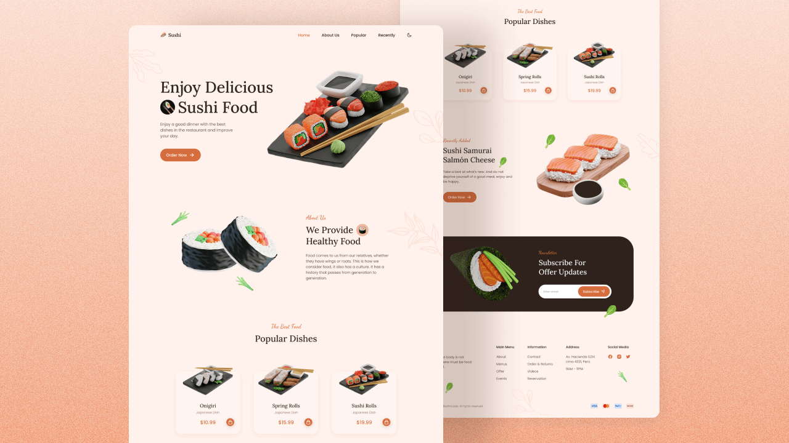

<h1 align="center">Honkai Sushi | Restaurante de comida japonesa.</h1>

    

 

  

# 📄 Description

What was developed?
A Japanese food restaurant website made with HTML, CSS and JavaScript. The site is responsive and has a navigation menu, "about" area, a section with the most ordered dishes, a contact section and a footer. Made with mobile first and has a dark theme.

Stack used:

### HTML5

### CSS3

### JavaScript

### ScrollReveal

